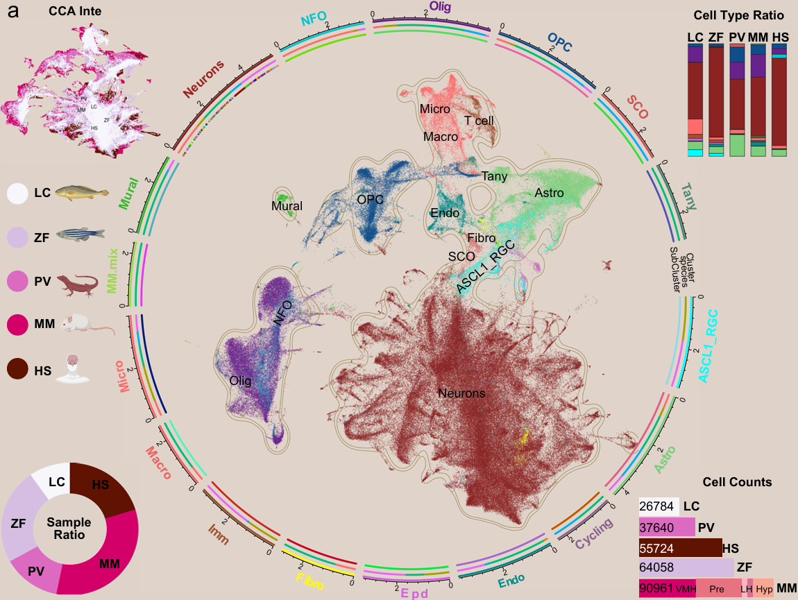

# Cross-Species HVG-CCA: Adaptive Ortholog Alignment for Single-Cell Integration

[](https://www.r-project.org/)
[](https://satijalab.org/seurat/)
[](https://snakemake.github.io/)
[](./containers/Dockerfile)
[](./LICENSE)

> **A novel method for cross-species single-cell RNA-seq integration when standard ortholog-based alignment fails.**
>
> Specifically designed for datasets that include teleost fish (zebrafish, large yellow croaker, etc.), whose genome duplications produce multi-copy genes that cannot be trivially mapped to mammalian single-copy orthologs.

---

## The Problem

Cross-species scRNA-seq integration with Seurat CCA requires that **all species share the same gene names**. Standard approaches use orthologous gene tables (e.g., Ensembl Compara, OrthoFinder), but this breaks down when:

1. **Fish have multi-copy genes** due to the teleost-specific whole-genome duplication (TGD). A mammalian gene like `SOX2` maps to `sox2a` and `sox2b` in zebrafish — which paralog do you choose?

2. **Manual curation doesn't scale.** For 2000+ genes, you cannot manually decide which paralog to align.

3. **Expression patterns differ between paralogs.** Different tissues/cell types use different copies — a static ortholog table can't capture this tissue-specific logic.

## Our Solution: Adaptive HVG-Based Ortholog Alignment

We flip the problem: instead of starting from a pre-defined ortholog table, we **let the expression data decide**.

### Core Algorithm

```
For each species independently:
  1. Compute top N Highly Variable Genes (HVGs) using Seurat's vst method
  2. Single-copy species (human, mouse, lizard): convert gene symbols to UPPERCASE
  3. Multi-copy species (fish): for each gene family, rank paralogs by mean expression
     → Select the highest-expressed paralog as the "ortholog proxy"
  4. Intersect gene sets across all species
  5. Output: a unified gene list where every species shares the same gene names
```

### Why This Works

- **HVGs capture biological signal.** The top 2000 variable genes per species represent the most informative transcriptional variation — exactly what you want for integration.
- **Expression-weighted paralog selection.** If `sox2a` has 10× higher expression than `sox2b` in hypothalamic cells, it's the functional ortholog *for this tissue*. The adaptive ranking captures this context-specific logic automatically.
- **No external databases required.** Pure data-driven alignment, no dependency on ortholog annotation quality.

### Species Supported

| Species                | Copy Type | Gene Name Convention | Notes                              |
|------------------------|-----------|----------------------|------------------------------------|
| Human                  | single    | Uppercase (e.g., SOX2)| Standard mammalian                 |
| Mouse                  | single    | Uppercase (e.g., SOX2)| Standard mammalian                 |
| Brown anole lizard     | single    | Uppercase (e.g., SOX2)| Reptilian, single-copy             |
| Zebrafish              | multi     | Lowercase + suffix   | Teleost WGD, ~30% duplicated genes |
| Large yellow croaker   | multi     | Lowercase + suffix   | Teleost WGD, ~30% duplicated genes |

---

## Project Structure

```
cross-species-hvg-cca/
├── README.md
├── LICENSE
├── .gitignore
├── Snakefile                              # Snakemake entry point (symlink)
├── R/
│   └── adaptive_ortholog.R               # Core algorithm (~400 lines)
├── config/
│   ├── config.yaml                        # Pipeline parameters
│   └── species.yaml                       # Species definitions
├── workflow/
│   ├── Snakefile                          # Main Snakemake workflow
│   ├── rules/                             # Per-step rules
│   └── scripts/                           # R scripts (Snakemake-compatible)
│       ├── preprocess.R
│       ├── align.R
│       ├── integrate.R
│       └── visualize.R
├── envs/
│   └── seurat.yaml                        # Conda environment
├── containers/
│   └── Dockerfile                         # Docker/Singularity support
├── scripts/                               # Standalone R scripts (manual mode)
│   ├── 01_preprocessing.R
│   ├── 02_adaptive_ortholog_alignment.R
│   ├── 03_cca_integration.R
│   └── 04_visualization.R
├── vignettes/
│   └── tutorial.Rmd
├── data/                                  # Processed data (gitignored)
├── figures/                               # Output figures
└── results/                               # Analysis results
```

---

## One-Click Reproducible Pipeline (Snakemake)

The entire pipeline can be run with a single command:

```bash
# 1. Edit your species configuration
vim config/species.yaml

# 2. Run the full pipeline
snakemake --cores 8 --use-conda

# That's it. Output in results/ and figures/
```

### Snakemake Quick Reference

```bash
# Preview what will run (dry-run)
snakemake --cores 8 --dry-run

# Run specific step
snakemake data/all_species_preprocessed.rds    # Only preprocessing
snakemake results/align_result.rds             # Up to alignment
snakemake results/integrated_seurat.rds        # Up to integration
snakemake figures/fig6_combined_panel.png      # Full pipeline

# Force re-run everything
snakemake --cores 8 --forcerun all

# Generate interactive HTML report
snakemake --cores 8 --report results/pipeline_report.html

# Clean all generated files
snakemake clean

# With Docker (no local dependencies needed)
docker build -t cross-species-hvg-cca .
docker run -v $(pwd)/data:/app/data -v $(pwd)/results:/app/results \
    cross-species-hvg-cca snakemake --cores 8
```

### Configuration

All parameters in `config/config.yaml`:

| Parameter | Default | Description |
|-----------|---------|-------------|
| `n_hvg` | 2000 | HVGs per species |
| `n_dim` | 30 | CCA dimensions |
| `integration_method` | cca | "cca" or "rpca" |
| `cluster_resolution` | 0.5 | Seurat clustering |
| `min_features` | 200 | Min features per cell |
| `max_mt_percent` | 25 | Max MT% filter |
| `mem_gb` | 32 | Memory allocation |
| `threads` | 8 | CPU threads |

Species defined in `config/species.yaml` — add your species there.

---

## Quick Start (Manual)

### Prerequisites

```r
install.packages(c("Seurat", "ggplot2", "patchwork", "optparse", "Matrix"))
```

### Step-by-Step SOP

#### Step 1: Preprocess Each Species

```bash
cd scripts
Rscript 01_preprocessing.R \
  --species_config species_config.yaml \
  --outdir ../data \
  --min_features 200 \
  --max_mt_percent 25
```

This produces `../data/all_species_preprocessed.rds` containing a named list of Seurat objects.

**Species config format** (`species_config.yaml`):

```yaml
human:
  data_dir: "path/to/human/filtered_feature_bc_matrix"
  copy_type: "single"
  mt_pattern: "^MT-"

zebrafish:
  data_dir: "path/to/zebrafish/filtered_feature_bc_matrix"
  copy_type: "multi"
  copy_pattern: "^(\w+?)([a-z]\d*|[a-z]?)$"
  mt_pattern: "^mt-"
```

#### Step 2: Adaptive Ortholog Gene Alignment

```bash
Rscript 02_adaptive_ortholog_alignment.R \
  --input ../data/all_species_preprocessed.rds \
  --n_hvg 2000 \
  --outdir ../data
```

**Key outputs:**
- `align_result.rds` — full alignment object
- `aligned_gene_map.csv` — gene-by-species mapping table
- `aligned_genes.txt` — gene list for CCA

#### Step 3: CCA Integration

```bash
Rscript 03_cca_integration.R \
  --input ../data/all_species_preprocessed.rds \
  --align_result ../data/align_result.rds \
  --n_dim 30 \
  --outdir ../data
```

Produces `integrated_seurat.rds`.

#### Step 4: Visualization

```bash
Rscript 04_visualization.R \
  --input ../data/integrated_seurat.rds \
  --outdir ../figures
```

**Outputs:**
- `fig1_umap_by_species.png` — UMAP colored by species
- `fig2_umap_split.png` — Per-species faceted UMAP
- `fig3_umap_by_cluster.png` — UMAP colored by cluster
- `fig4_species_composition.png` — Cluster composition barplot
- `fig5_cca_by_species.png` — CCA plot
- `fig6_cell_counts.png` — Cell counts per species
- `fig7_combined_panel.png` — Publication-ready combined figure

---

## Using the Core Function Directly

For interactive use in R:

```r
source("R/adaptive_ortholog.R")

# Your list of Seurat objects (one per species)
seurat_list <- list(
  human    = human_obj,
  mouse    = mouse_obj,
  lizard   = lizard_obj,
  zebrafish = zebrafish_obj,
  croaker  = croaker_obj
)

# Define species information
species_info <- list(
  human    = list(copy_type = "single"),
  mouse    = list(copy_type = "single"),
  lizard   = list(copy_type = "single"),
  zebrafish = list(copy_type = "multi",
                   copy_pattern = "^(\w+?)([a-z]\d*|[a-z]?)$"),
  croaker  = list(copy_type = "multi",
                  copy_pattern = "^(\w+?)([a-z]\d*|[a-z]?)$")
)

# Run alignment
align_result <- adaptive_ortholog_align(
  seurat_objects = seurat_list,
  species_info   = species_info,
  n_hvg          = 2000,
  verbose        = TRUE
)

# Inspect
print(align_result)
head(align_result$gene_map)

# Which paralogs were selected for zebrafish?
align_result$multi_copy_choices$zebrafish
```

### Customizing the Paralog Detection Pattern

For species with non-standard gene naming, adjust `copy_pattern`:

```r
# Default: strips trailing letter + optional digit
# e.g., sox2a -> sox2, sox2b -> sox2, sox21a -> sox21
"^(\w+?)([a-z]\d*|[a-z]?)$"

# For species with dot-separated paralogs (e.g., sox2.1, sox2.2):
"^(\w+?)(\.\d+)$"

# For species with underscore paralogs (e.g., sox2_a, sox2_b):
"^(\w+?)(_[a-z]\d*)$"
```

---

## Method Rationale (Detailed)

### Why HVGs Instead of Orthologs?

Traditional cross-species integration uses orthologous gene tables (BioMart, OrthoFinder, etc.). This has three failure modes for fish:

1. **Ambiguity**: One mammalian gene → multiple fish paralogs. Which one is "the" ortholog?
2. **Absence**: Not all genes have annotated orthologs. For 2000 genes, you'll lose 10-30% due to annotation gaps.
3. **Tissue specificity**: Ortholog tables are genome-wide. They don't know that `sox2b` is the brain-expressed copy while `sox2a` is the muscle-expressed one.

Our HVG-based approach:
- Each species independently selects its own most informative genes
- For multi-copy species, expression data resolves paralog ambiguity tissue-specifically
- The intersection ensures only genuine shared biology is used for integration
- No external annotation dependency

### Parameter Guidance

| Parameter | Default | When to Tune |
|-----------|---------|--------------|
| `n_hvg` | 2000 | Fewer species → increase (more genes intersect). More species → decrease (maintain intersection size). |
| `copy_pattern` | See above | Adjust if your species has non-standard gene naming |
| CCA `n_dim` | 30 | More species/samples → increase to 50. Small datasets → decrease to 20. |

**Diagnostic**: If the intersection size is <100 genes, reduce `n_hvg` per species or check your `copy_pattern` regex. If >3000 genes, you may be including noise — increase stringency by decreasing `n_hvg`.

---

## Example Results



*CCA integration of hypothalamic single-cell transcriptomes from 5 species (human, mouse, lizard, zebrafish, large yellow croaker) using adaptive HVG-based ortholog alignment. Each point is a single cell, colored by species.*

---

## Citation

If you use this method, please cite:

```
[Citation information — bioRxiv soon]
```

And please credit the method as:

> Adaptive HVG-based cross-species ortholog alignment for scRNA-seq integration

---

## Contributing

Contributions welcome! Open an issue or pull request for:
- Additional species configurations
- Improved paralog detection patterns
- Integration with other methods (Harmony, scVI, etc.)
- Multi-omics extensions

---

## License

MIT License — see [LICENSE](./LICENSE) for details.
